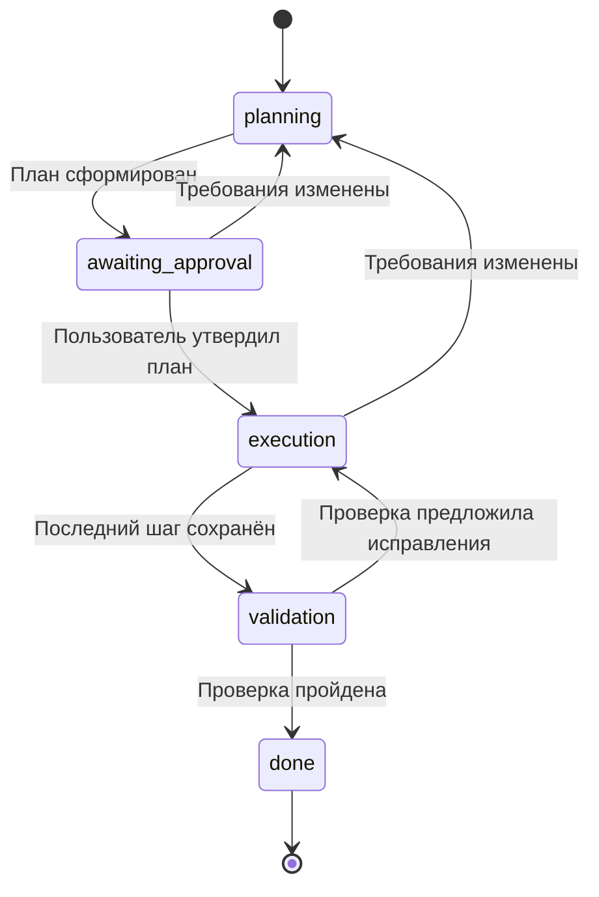

# Контролируемые переходы состояний

Backend управляет жизненным циклом задачи. Модель создаёт план, результат одного
шага или отчёт проверки; она не выбирает состояние, не утверждает план и не
устанавливает прогресс. Поля `state` в структурированных ответах модели запрещены.



## События и условия

| Состояние | Основное действие | Условие перехода | Дополнительные действия |
|---|---|---|---|
| `planning` | `generate_plan` | Непустые шаги и критерии | `pause`, `replan` |
| `awaiting_approval` | `approve` | Явное утверждение пользователем | `pause`, `replan` |
| `execution` | `execute_step` | План утверждён, сохранён результат текущего шага | `pause`, `replan` |
| `validation` | `validate` | Все шаги завершены, корректный отчёт проверки | `pause` |
| `done` | Нет | Сохранены успешная проверка и итог | Нет |

Во время паузы разрешено только `resume`. Снятие паузы не запускает модель:
следующее действие выполняется отдельно. `advance` сохранён как совместимый
алиас для формирования плана, выполнения шага или проверки; он никогда не
утверждает план автоматически.

Публичные доменные операции в `app/state/task.py`: `propose_plan`, `approve_plan`,
`complete_step`, `apply_validation`, `replan`, `pause`, `resume`. Общая смена
состояния является внутренней операцией `_transition`. Она проверяет таблицу
переходов, а снимок дополнительно проверяет согласованность данных:

- выполнение и проверка требуют `plan_approved=true`;
- завершение требует всех результатов, `validation_passed=true`, отчёта и итога;
- результат шага соответствует его названию и не бывает пустым;
- пересмотр плана сохраняет прежние результаты, сбрасывает утверждение и проверку;
- неуспешная проверка добавляет шаги исправления без повторения готовых шагов.

`TaskOrchestrator` проверяет действие до вызова провайдера. `ChatSessionService`
проверяет актуальную версию снимка и допустимость действия до загрузки памяти
и генерации. Обычный чат не позволяет обойти активную задачу. Интерфейс показывает
пять этапов и строит доступность кнопок по `allowed_actions` из backend.

## API отказов

`GET /api/chat/sessions/{id}` возвращает снимок с `allowed_actions`,
`plan_approved`, `validation_passed`, этапом, прогрессом и `revision`.
Действия отправляются в `POST /api/chat/sessions/{id}/task/actions`:

```json
{"action": "execute_step", "revision": 1}
```

Попытка выполнить шаг до утверждения возвращает HTTP 409:

```json
{
  "detail": {
    "code": "task_action_forbidden",
    "message": "План ещё не утверждён. Следующее действие: Утвердить план",
    "state": "awaiting_approval",
    "paused": false,
    "expected_action": "approve_plan",
    "allowed_actions": ["approve", "pause", "replan"]
  }
}
```

Ответ об устаревшей версии имеет `code=task_stale_revision` и актуальные
допустимые действия. Неизвестное действие, например `finish`, либо попытка
передать `state=done` в запросе отклоняются HTTP 422. Отказ в переходе не
изменяет снимок, историю, версии или память и не вызывает модель; интерфейс
показывает причину и обновляет сохранённый снимок. Отказы инвариантов ответов
из Дня 14 продолжают сохраняться как отдельные сообщения без изменения прогресса.

## Пауза и совместимость

SQLite атомарно сохраняет результат действия, сообщения и новый снимок.
Пауза меняет `revision`, сохраняя `progress_revision`, поэтому уже начатый
ответ может завершиться и сохраниться вместе с актуальным флагом паузы.
Если начатая проверка успешна, задача становится `done` и не остаётся на паузе.
При аварийном завершении процесса незаписанное действие можно повторить.

Старые снимки Дня 13/14 читаются без миграции таблиц. Сформированный план в
`planning` становится `awaiting_approval`; прежние этапы выполнения получают
признак уже утверждённого плана, а `done` — признак успешной проверки. Это
преобразование применяется только при отсутствии новых полей в сохранённом
снимке. Явный `plan_approved=false` не исправляется автоматически. Прогресс,
результаты, пауза и версии сохраняются.

## Проверки

```bash
python -m pytest -q
python -m compileall -q app tests
node --check static/app.js
```

`tests/test_task_state.py` проверяет доменные условия и чтение старых снимков.
`tests/test_tasks.py` проверяет матрицу запрещённых API-действий для каждого
этапа и паузы, отсутствие вызовов модели и изменений при отказе, явный цикл
с повторным утверждением, попытки передать состояние через API или ответ
модели, восстановление после перезапуска и паузу во время генерации.
